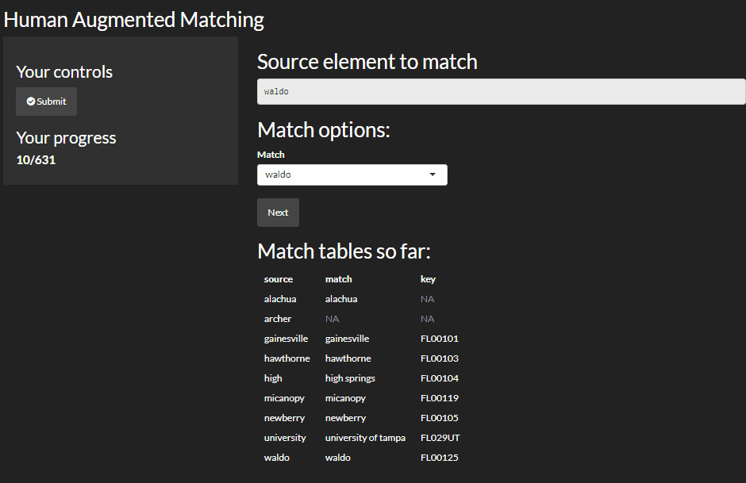

# Human Augmented Matching

Sometimes, it's quicker to just do it yourself. 

## Install

``` r
devtools::install_github("jknowles/ham")
library(ham)
```

## In Action



## Code

`ham` takes only a few arguments:

- `source` - a vector of elements you want to match
- `choices` - a vector of options to match to `source`
- `key` - an optional vector the length and order of `choices` to match to

Behind the scenes `ham` does a simple agrep (fuzzy lookup) of each element in 
`source` in the `choices` set, then presents the user with the options and 
let's them select which one is correct. 

Some examples below:

``` r
source <- letters
key <- c(letters, paste0(letters, 2), paste0(letters, 1))
ham(source = source, choices = key)
ham(source = letters, 
  choices = c(letters, paste0(letters, 1), paste0(letters, 2)),
  key = 101:178)
```

The result will be a data.frame called `match_table` written to your global 
environment. 
